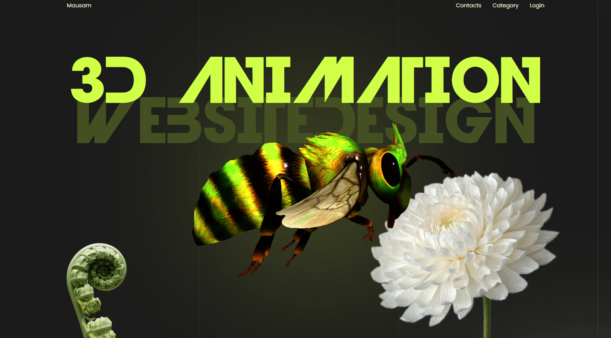
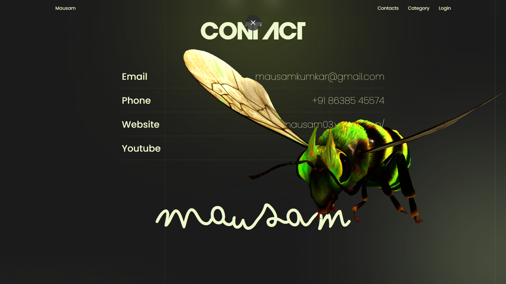

# 🎨 WASP Interaction GSAP

  
  

  
  
  
  
  

  
  
  

> A fully responsive 3D animated website showcasing creative interactions and animations using GSAP (GreenSock Animation Platform).

## 📋 Table of Contents
- [Live Demo](#-live-demo)
- [Features](#-features)
- [Tech Stack](#-tech-stack)
- [Project Purpose](#-project-purpose)
- [Author](#-author)
- [About](#-about)

## 🔗 Live Demo

[View Live Site →](https://mausam-gsap-animation.netlify.app/)

## ✨ Features

| Category | Features |
|----------|----------|
| Animation | • GSAP timeline and easing animations • Smooth scroll transitions • Scroll-based 3D interactions |
| Design | • Fully responsive 3D animated website • Layered motion design with parallax • Custom cursor effects |
| Experience | • Interactive UI elements • Seamless section transitions • Cinematic storytelling |

## 🛠️ Tech Stack

| Technology | Purpose |
|------------|---------|
| GSAP | Core animation platform |
| HTML5 | Structure and semantics |
| CSS3 | Styling and animations |
| JavaScript | Interactivity and logic |
| Three.js | 3D model rendering |

## 🎯 Project Purpose

This project demonstrates the power of modern web animations and interactions, creating an immersive user experience through:

- 🚀 High-performance animations
- 🌊 Fluid and natural motion
- 🎨 Enhanced visual appeal
- 🤝 Intuitive user experience
- 📱 Responsive design principles

## 👤 Author

| Detail | Information |
|--------|-------------|
| Name | Mausam Kar |
| Website | [mausam03.vercel.app](https://mausam03.vercel.app/) |
| Email | mausamkumkar@gmail.com |
| Phone | +91 86385 45574 |

## 💡 About

This project is designed to showcase how modern web design can be both functional and expressive, making it ideal for:

- 🎭 Portfolios
- 🎨 Creative agencies
- 🏢 Digital brands
- 🎮 Interactive web experiences

The website combines creativity with interactivity to deliver a seamless, engaging user experience across all devices.

---

  Built with ❤️ by Mausam Kar

 